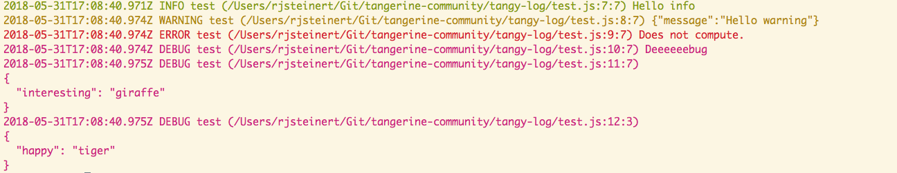

# tangy-log

## Install
Install with `npm install --save tangy-log`.

## Usage
```
const log = require('tangy-log').log
// clog function is a shortcut to output messages with LOG_LEVEL_DEBUG. It's also an easy thing to grep for since you 
// shouldn't have debug messages in your codebase.
const clog = require('tangy-log').clog

log.info('Hello info')
log.warn({ message: 'Hello warning'} )
log.error('Does not compute.')
log.debug('Deeeeeebug')
log.debug({ interesting: 'giraffe'})
clog({ happy: 'tiger'})
```

Output looks like...

